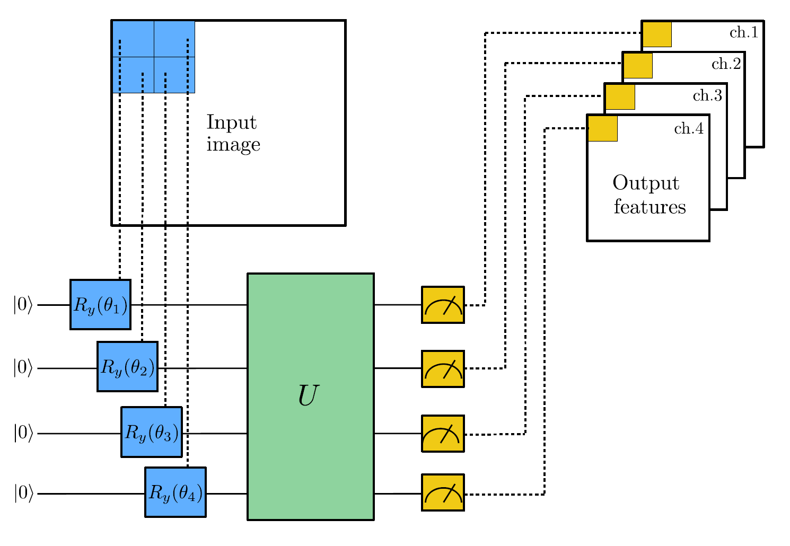
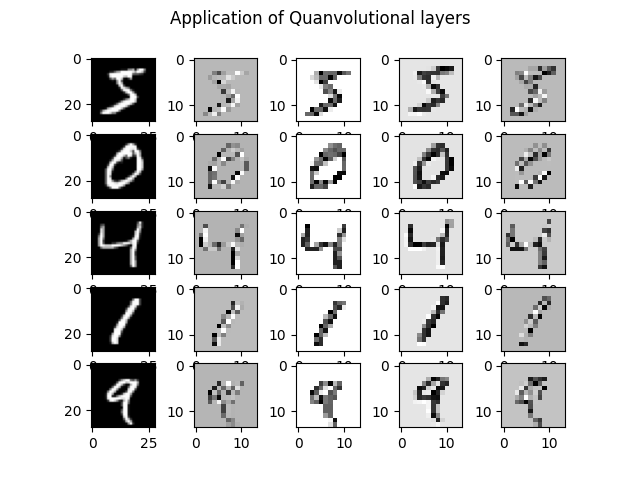
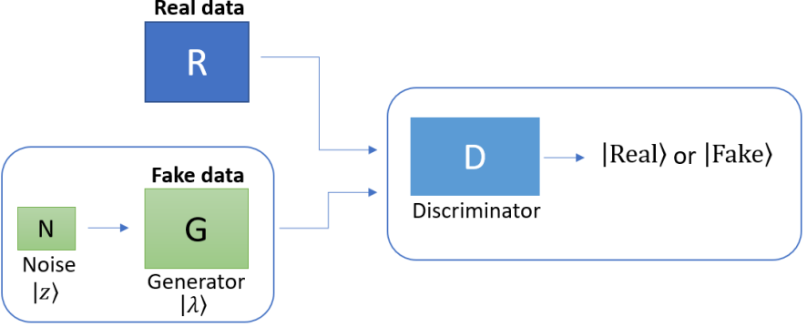
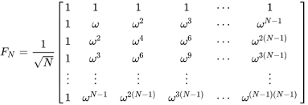
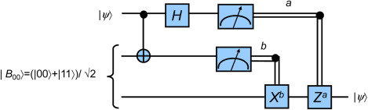
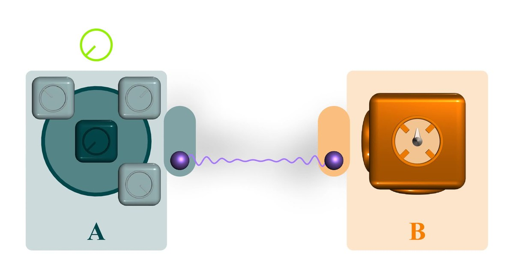

# Quantum Machine Learning <!-- omit in toc -->

- [Quanvolutional Neural Networks](#quanvolutional-neural-networks)
- [Quantum Generative Adversarial Networks](#quantum-generative-adversarial-networks)
  - [Resources](#resources)
- [Quantum GANs for image data generation](#quantum-gans-for-image-data-generation)
  - [The Patch Method for QGANs](#the-patch-method-for-qgans)
- [Quantum Fourier Transform](#quantum-fourier-transform)
- [Quantum Teleportation](#quantum-teleportation)
- [Superdense Coding](#superdense-coding)


## Quanvolutional Neural Networks
|  |  |
| ----------------------------------------------- | ------------------------------------------------------ |

**Quantum Neural Network (QNN)** extend the capabilities of **CNNs** by introducing a new type of transformed layer: **Quanvolutional layer**. They are made up of a group of N quantum filters (random quantum circuits), making a feature map through the transformed input data. It is hypothesized that quanvolutional features would increase the accuracy of ML models. This will be only because of two reasons:

1. **Quanvolutional filter** are applied to only *local subsections* of the input data, so they can operate using a small number of quantum bits with shallow gate depths.
2. **Quanvolutional are resilient to error**; as long as the error model in the quantum circuit is consistent, it can essentially be thought as another component of the random quantum circuit.

## Quantum Generative Adversarial Networks

<center></center>

> CodeBook: Quantum GANs - states.ipynb

Quantum Generative Adversarial Networks (Quantum GANs) are a novel approach to data preparation and augmentation, leveraging the principles of quantum computing and generative adversarial networks (GANs). 

One of the challenges in applying quantum computing techniques to classical data is the overhead associated with encoding the data into a quantum state. Quantum GANs address this challenge by employing approximate data encoding techniques, which trade-off a degree of precision for computational efficiency.

### Resources

- [QGANs & QBMs](https://www.youtube.com/watch?v=yzcWIz5pfOs)

---
## Quantum GANs for image data generation

<center></center>

> CodeBook: Quantum GANs - images.ipynb

The goal of Generative Adversarial Networks (GANs) is to generate data that resembles the original data used in training. This is achieved by training two neural networks simultaneously: a generator and a discriminator.

The two networks are trained iteratively, each with a separate loss function to be minimized:

```python
L_D = -[y.log(D(x)) + (1-y).log(1-D(G(z)))]
L_G = [(1-y).log(1-D(G(z)))]
```

### The Patch Method for QGANs

This implementation uses the Patch Method for Quantum Generative Adversarial Networks (QGANs). The key idea is to use several quantum generators, with each sub-generator G(i) responsible for creating a small patch of the final image. The final image is constructed by concatenating all the patches together.

---
## Quantum Fourier Transform

<center></center>

> CodeBook: QuantumFourierTransform.ipynb

The QFT is a quantum analog of the classical Discrete Fourier Transform (DFT), capable of efficiently computing the Fourier transform of a quantum state. The QFT can be implemented efficiently on a quantum computer using only a polynomial number of quantum gates, offering an exponential speedup over classical algorithms for certain problems. This remarkable quantum algorithm has profound implications for fields such as cryptography and the study of periodic structures in quantum systems.

---
## Quantum Teleportation

<center></center>

> CodeBook: QuantumTeleportation.ipynb

Quantum Teleportation allows the transfer of an unknown quantum state from one location to another, with the help of classical communication and previously shared quantum entanglement.

## Superdense Coding

<center></center>

> CodeBook: SuperdenseCoding.ipynb

Superdense Coding allows the transmission of two classical bits of information by sending only one qubit, exploiting the principles of quantum entanglement.